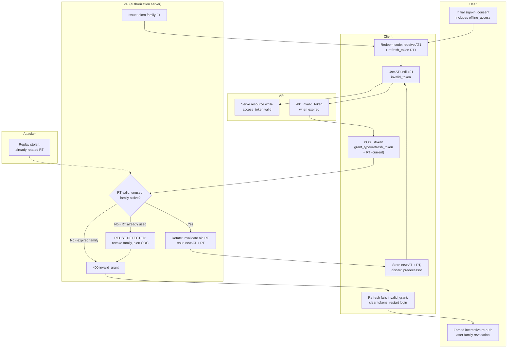

# Refresh Token Grant — Swimlane

User appears only for the initial consent and the forced re-auth after a family
revocation; the steady state is Client–IdP–API.

```mermaid
flowchart TD
    subgraph User
        U1["Initial sign-in, consent<br/>includes offline_access"]
        U2["Forced interactive re-auth<br/>after family revocation"]
    end

    subgraph Client
        C1["Redeem code: receive AT1<br/>+ refresh_token RT1"]
        C2["Use AT until 401<br/>invalid_token"]
        C3["POST /token<br/>grant_type=refresh_token<br/>+ RT (current)"]
        C4["Store new AT + RT,<br/>discard predecessor"]
        C5["Refresh fails invalid_grant:<br/>clear tokens, restart login"]
    end

    subgraph IdP["IdP (authorization server)"]
        I1["Issue token family F1"]
        I2{"RT valid, unused,<br/>family active?"}
        I3["Rotate: invalidate old RT,<br/>issue new AT + RT"]
        I4["REUSE DETECTED:<br/>revoke family, alert SOC"]
        I5["400 invalid_grant"]
    end

    subgraph API
        A1["Serve resource while<br/>access_token valid"]
        A2["401 invalid_token<br/>when expired"]
    end

    subgraph Attacker
        X1["Replay stolen,<br/>already-rotated RT"]
    end

    U1 --> C1 --> C2 --> A1
    C2 --> A2 --> C3 --> I2
    I1 --> C1
    I2 -->|Yes| I3 --> C4 --> C2
    I2 -->|"No - expired family"| I5 --> C5 --> U2
    X1 -.-> I2
    I2 -->|"No - RT already used"| I4 --> I5
```
