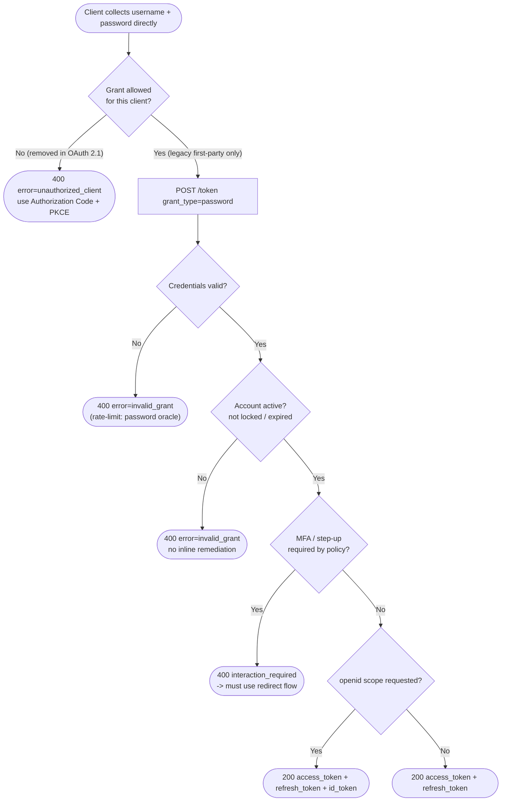

# ROPC — Decision Flowchart

From the client collecting a password through credential and MFA checks, with
explicit error terminals and the push toward the redirect-based replacement.

```mermaid
flowchart TD
    S(["Client collects username + password directly"]) --> Q0{Grant allowed<br/>for this client?}
    Q0 -->|"No (removed in OAuth 2.1)"| E0(["400 error=unauthorized_client<br/>use Authorization Code + PKCE"])
    Q0 -->|"Yes (legacy first-party only)"| TK["POST /token grant_type=password"]

    TK --> Q1{Credentials valid?}
    Q1 -->|No| E1(["400 error=invalid_grant<br/>(rate-limit: password oracle)"])
    Q1 -->|Yes| Q2{Account active?<br/>not locked / expired}
    Q2 -->|No| E2(["400 error=invalid_grant<br/>no inline remediation"])
    Q2 -->|Yes| Q3{MFA / step-up<br/>required by policy?}
    Q3 -->|Yes| E3(["400 interaction_required<br/>-> must use redirect flow"])
    Q3 -->|No| Q4{openid scope requested?}
    Q4 -->|Yes| T1(["200 access_token + refresh_token + id_token"])
    Q4 -->|No| T2(["200 access_token + refresh_token"])
```
