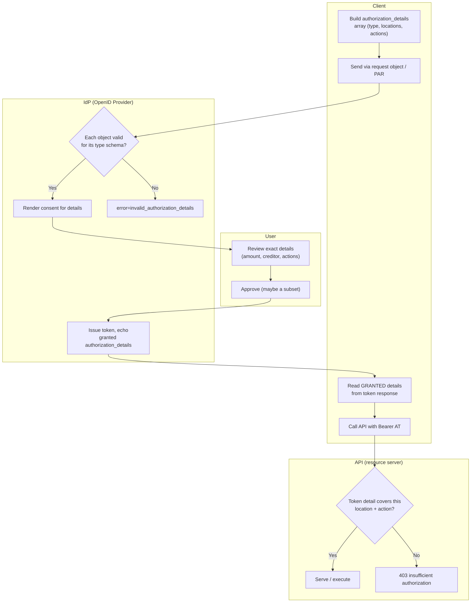

# Rich Authorization Requests — Swimlane

The Client requests structured details; the IdP validates and renders consent; the
API enforces the granted details per call.

```mermaid
flowchart TD
    subgraph User
        U1["Review exact details<br/>(amount, creditor, actions)"]
        U2["Approve (maybe a subset)"]
    end

    subgraph Client
        C1["Build authorization_details<br/>array (type, locations, actions)"]
        C2["Send via request object / PAR"]
        C3["Read GRANTED details<br/>from token response"]
        C4["Call API with Bearer AT"]
    end

    subgraph IdP["IdP (OpenID Provider)"]
        I1{"Each object valid<br/>for its type schema?"}
        I2["Render consent for details"]
        I3["Issue token, echo<br/>granted authorization_details"]
        I4["error=invalid_authorization_details"]
    end

    subgraph API["API (resource server)"]
        A1{"Token detail covers this<br/>location + action?"}
        A2["Serve / execute"]
        A3["403 insufficient authorization"]
    end

    C1 --> C2 --> I1
    I1 -->|No| I4
    I1 -->|Yes| I2 --> U1 --> U2 --> I3 --> C3 --> C4 --> A1
    A1 -->|Yes| A2
    A1 -->|No| A3
```
