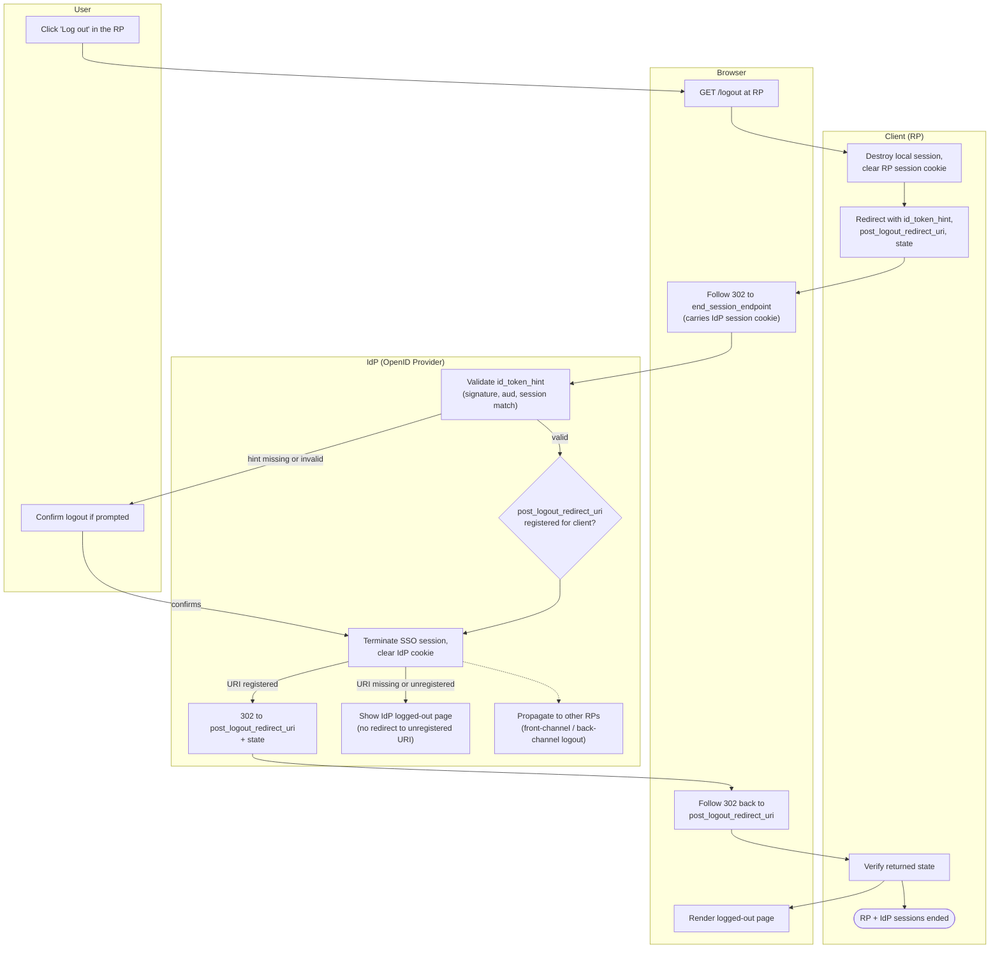

# RP-Initiated Logout — Swimlane Diagram

One lane per actor; the propagation hand-off to other RPs is shown as a dashed
exit to the front-/back-channel diagrams.

Related: [README](README.md) | [Sequence](sequence.md) | [Flowchart](flowchart.md)
