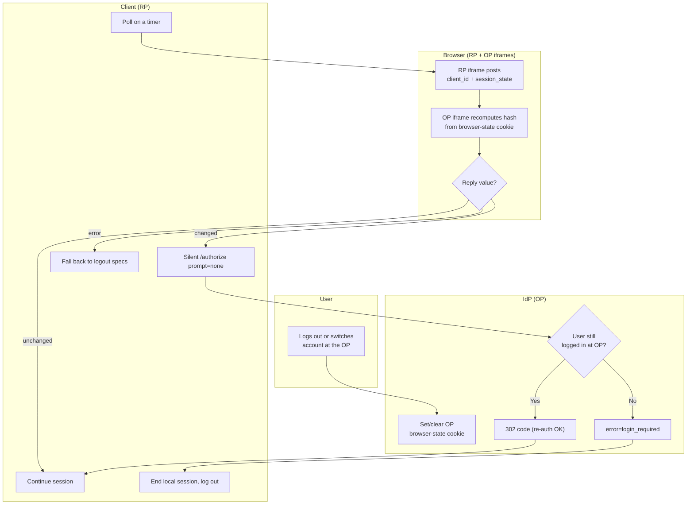

# OIDC Session Management — Swimlane

The Browser hosts both iframes and relays `postMessage`; the Client owns polling and
silent re-auth; the IdP owns the OP session cookie and `prompt=none` answers.

