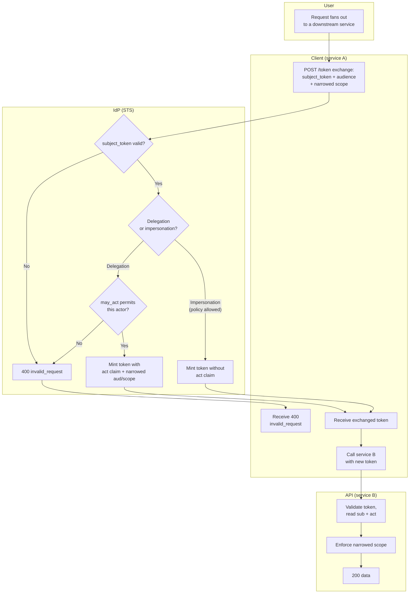

# Token Exchange — Swimlane

The IdP (STS) lane decides delegation vs impersonation and enforces `may_act`; the
Client lane calls the downstream API with the exchanged token.

```mermaid
flowchart TD
    subgraph User
        U1["Request fans out<br/>to a downstream service"]
    end

    subgraph Client["Client (service A)"]
        C1["POST /token exchange:<br/>subject_token + audience<br/>+ narrowed scope"]
        C2["Receive exchanged token"]
        C3["Call service B<br/>with new token"]
        C4["Receive 400<br/>invalid_request"]
    end

    subgraph IdP["IdP (STS)"]
        I1{"subject_token valid?"}
        I2{"Delegation<br/>or impersonation?"}
        I3{"may_act permits<br/>this actor?"}
        I4["Mint token with<br/>act claim + narrowed aud/scope"]
        I5["Mint token without<br/>act claim"]
        I6["400 invalid_request"]
    end

    subgraph API["API (service B)"]
        A1["Validate token,<br/>read sub + act"]
        A2["Enforce narrowed scope"]
        A3["200 data"]
    end

    U1 --> C1 --> I1
    I1 -->|No| I6 --> C4
    I1 -->|Yes| I2
    I2 -->|Delegation| I3
    I3 -->|No| I6
    I3 -->|Yes| I4 --> C2
    I2 -->|"Impersonation<br/>(policy allowed)"| I5 --> C2
    C2 --> C3 --> A1 --> A2 --> A3
```
