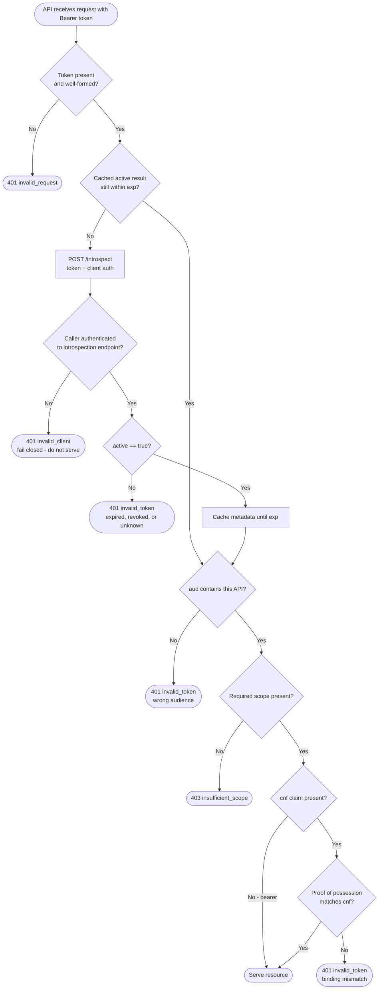

# Token Introspection — Decision Flowchart

From receiving a bearer token to the enforcement decision, with explicit error
terminals for each failure.

```mermaid
flowchart TD
    S(["API receives request with Bearer token"]) --> Q0{Token present<br/>and well-formed?}
    Q0 -->|No| E0(["401 invalid_request"])
    Q0 -->|Yes| Q1{Cached active result<br/>still within exp?}
    Q1 -->|Yes| ENF
    Q1 -->|No| CALL["POST /introspect<br/>token + client auth"]

    CALL --> Q2{Caller authenticated<br/>to introspection endpoint?}
    Q2 -->|No| E1(["401 invalid_client<br/>fail closed - do not serve"])
    Q2 -->|Yes| Q3{active == true?}
    Q3 -->|No| E2(["401 invalid_token<br/>expired, revoked, or unknown"])
    Q3 -->|Yes| CACHE["Cache metadata until exp"]
    CACHE --> ENF{"aud contains this API?"}

    ENF -->|No| E3(["401 invalid_token<br/>wrong audience"])
    ENF -->|Yes| Q4{Required scope present?}
    Q4 -->|No| E4(["403 insufficient_scope"])
    Q4 -->|Yes| Q5{cnf claim present?}
    Q5 -->|"No - bearer"| OK([Serve resource])
    Q5 -->|Yes| Q6{Proof of possession<br/>matches cnf?}
    Q6 -->|No| E5(["401 invalid_token<br/>binding mismatch"])
    Q6 -->|Yes| OK
```
