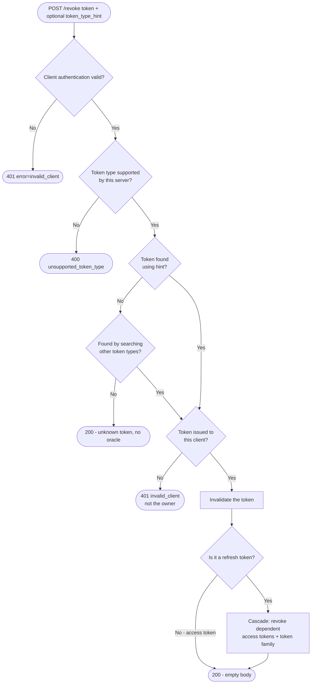

# Token Revocation — Decision Flowchart

The authorization server's handling of a `/revoke` request, including the
deliberate no-oracle success path.

```mermaid
flowchart TD
    S(["POST /revoke token + optional token_type_hint"]) --> Q1{Client authentication valid?}
    Q1 -->|No| E1(["401 error=invalid_client"])
    Q1 -->|Yes| Q2{Token type supported<br/>by this server?}
    Q2 -->|No| E2(["400 unsupported_token_type"])
    Q2 -->|Yes| Q3{Token found<br/>using hint?}
    Q3 -->|No| Q4{Found by searching<br/>other token types?}
    Q4 -->|No| OK2([200 - unknown token, no oracle])
    Q4 -->|Yes| Q5
    Q3 -->|Yes| Q5{Token issued to<br/>this client?}

    Q5 -->|No| E3(["401 invalid_client<br/>not the owner"])
    Q5 -->|Yes| INV["Invalidate the token"]
    INV --> Q6{Is it a refresh token?}
    Q6 -->|Yes| CASC["Cascade: revoke dependent<br/>access tokens + token family"]
    Q6 -->|"No - access token"| DONE
    CASC --> DONE([200 - empty body])
```
