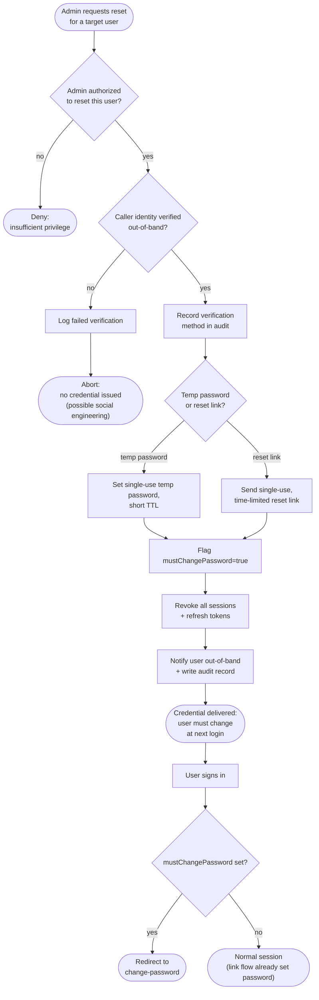

# Admin-Initiated Password Reset — Decision Flowchart

Branch-focused view: admin authorization, mandatory caller verification
(social-engineering gate), temp-password vs. reset-link choice, forced change at
next login, and session revocation.

