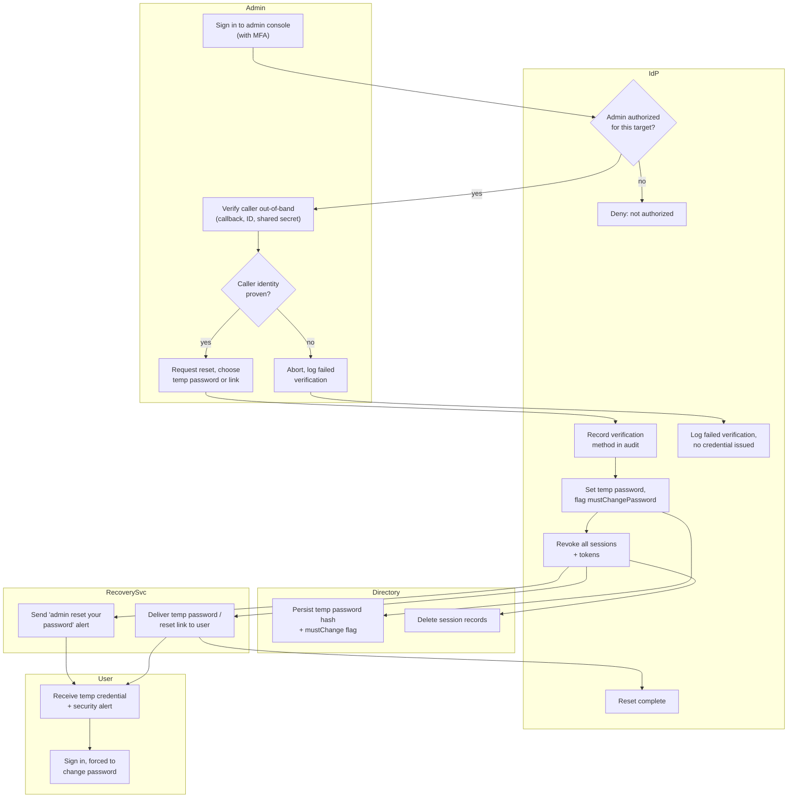

# Admin-Initiated Password Reset — Swimlane

One lane per actor. Steps sit in the lane of the actor performing them; arrows
cross lanes at handoffs.

```mermaid
flowchart TD
    subgraph Admin
        A1["Sign in to admin console<br/>(with MFA)"]
        A2["Verify caller out-of-band<br/>(callback, ID, shared secret)"]
        A3{"Caller identity<br/>proven?"}
        A4["Request reset, choose<br/>temp password or link"]
        A5["Abort, log failed<br/>verification"]
    end

    subgraph IdP
        I1{"Admin authorized<br/>for this target?"}
        I2["Record verification<br/>method in audit"]
        I3["Set temp password,<br/>flag mustChangePassword"]
        I4["Revoke all sessions<br/>+ tokens"]
        I5["Reset complete"]
        I6["Deny: not authorized"]
        I7["Log failed verification,<br/>no credential issued"]
    end

    subgraph Directory
        D1["Persist temp password hash<br/>+ mustChange flag"]
        D2["Delete session records"]
    end

    subgraph RecoverySvc
        R1["Deliver temp password /<br/>reset link to user"]
        R2["Send 'admin reset your<br/>password' alert"]
    end

    subgraph User
        U1["Receive temp credential<br/>+ security alert"]
        U2["Sign in, forced to<br/>change password"]
    end

    A1 --> I1
    I1 -->|no| I6
    I1 -->|yes| A2 --> A3
    A3 -->|no| A5 --> I7
    A3 -->|yes| A4 --> I2
    I2 --> I3 --> D1
    I3 --> I4 --> D2
    I4 --> R1 --> U1
    I4 --> R2 --> U1
    R1 --> I5
    U1 --> U2
```
