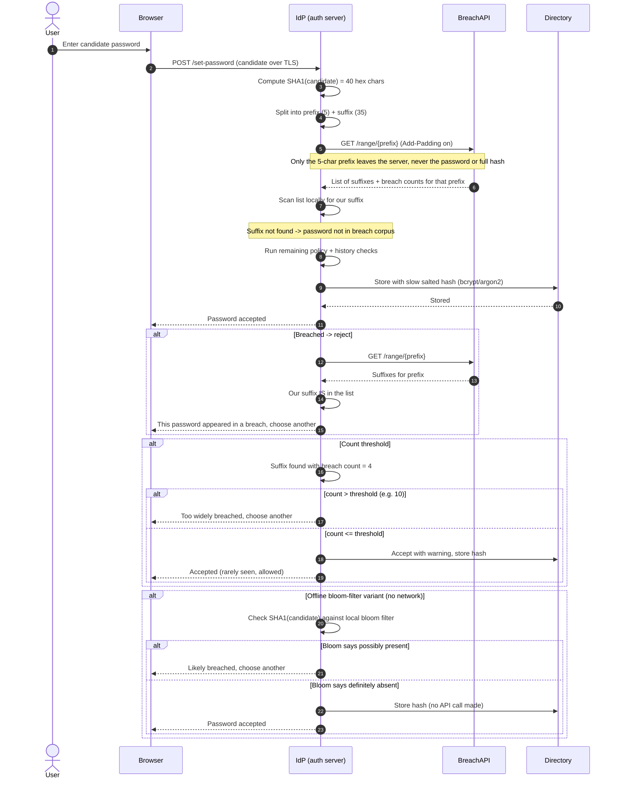

# Breached Password Detection — Sequence Diagram

Happy path: the auth server hashes the candidate with SHA-1, sends only the 5-char
prefix to the range API, receives all matching suffixes, and matches locally.
Alternates: breached password rejected, a breach-count threshold, and an offline
bloom-filter variant with no network call.

