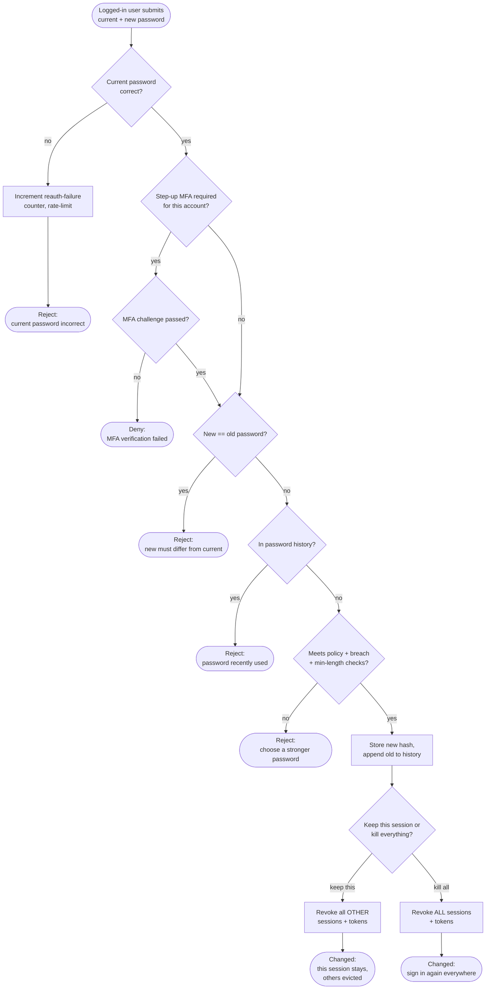

# Authenticated Password Change — Decision Flowchart

Branch-focused view: reauthentication with the current password, optional step-up
MFA, new-password policy/history/breach checks, and the post-change session
decision.

