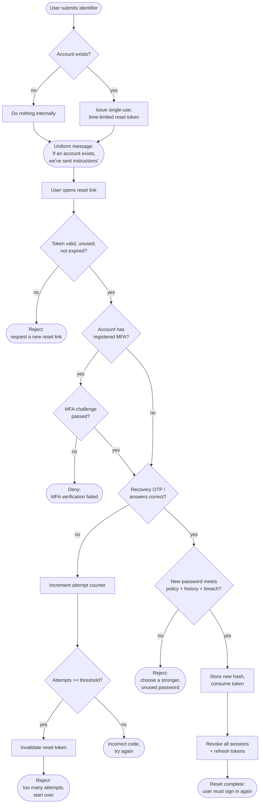

# Self-Service Password Reset — Decision Flowchart

Branch-focused view: enumeration guard on request, reset-token validity, recovery
factor verification with rate limiting, password policy, and mandatory session
invalidation.

