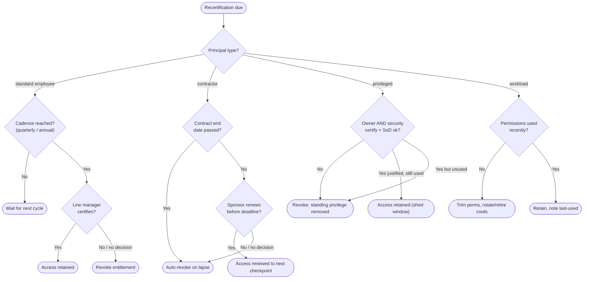

# Access Review by Persona — Decision Flowchart

Branch on principal type first, then on the cadence and approver decisions each path makes.
Terminal states are access retained or revoked.

Notes

- The default on **no decision** flips by persona: standard employees lean to revoke the
  specific entitlement, contractors auto-revoke on lapse, privileged revokes standing rights —
  none silently renew.
- Contractor access has a source-driven hard stop (`CEnd`) that fires with no human in the
  loop; the sponsor review only matters *within* the engagement window.
- Privileged and workload paths both gate on **last-used**: unused high-value access is revoked
  even when nominally justified, shrinking the standing-privilege surface.

Related: [README](README.md) | [Sequence](sequence.md) | [Swimlane](swimlane.md)
