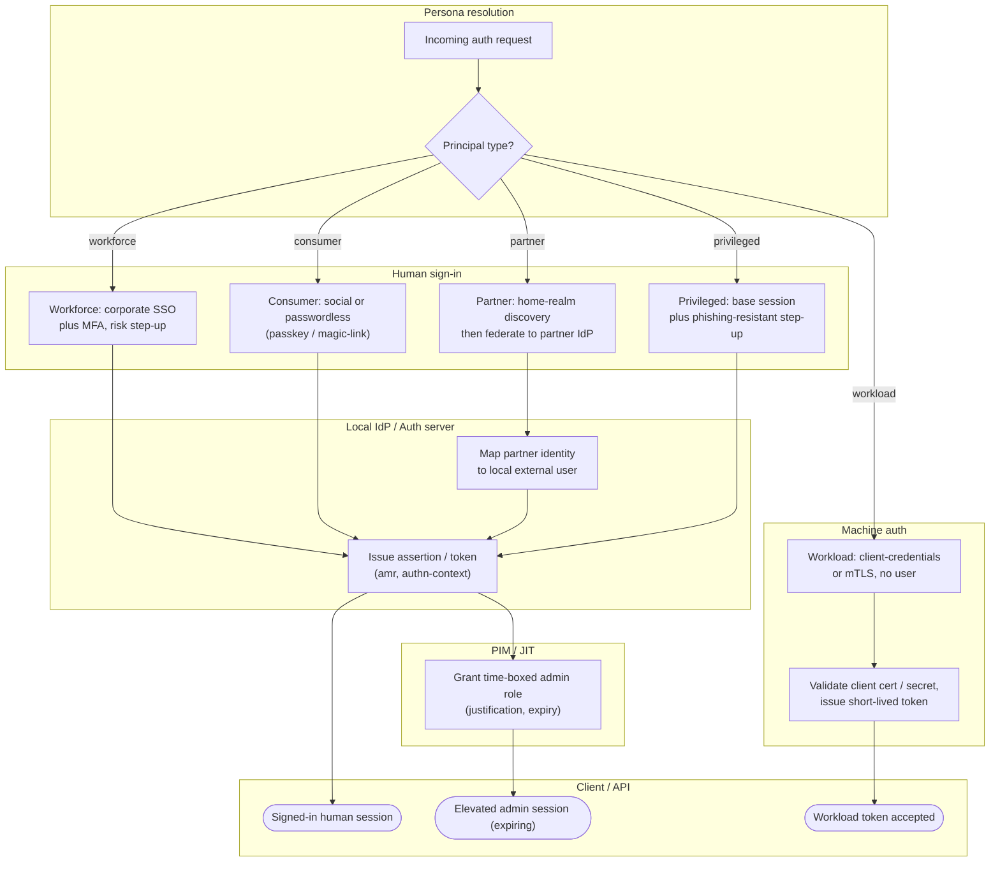

# Authentication by Persona — Swimlane Diagram

A router lane resolves the persona; each persona then flows through its own path across the
shared IdP and target lanes.

Notes

- The router is the fork point: everything downstream differs because the persona differs,
  not because the mechanism does.
- Privileged is the only human path that continues **past** the IdP into PIM before reaching
  a usable (elevated, expiring) session.
- The machine lane never touches the Human or PIM lanes — no interactive step exists for it.

Related: [README](README.md) | [Sequence](sequence.md) | [Flowchart](flowchart.md)
