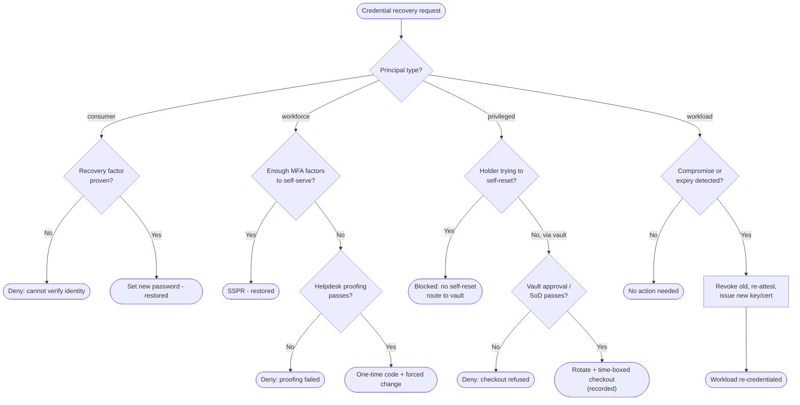

# Credential Recovery by Persona — Decision Flowchart

Branch on principal type first, then on the persona-specific decisions each recovery path must
make. Terminal states are restored access or a denial.

Notes

- The consumer leaf has no human fallback by design; the workforce leaf adds the proofed
  helpdesk path precisely because workforce lockouts are common and higher-value.
- The privileged `Self` diamond is a hard block: a self-reset attempt is refused and redirected
  to the vault, so approval and recording can never be bypassed.
- The workload path is the only one with no identity-proofing step — trust comes from
  re-attestation, not from a human vouching for the principal.

Related: [README](README.md) | [Sequence](sequence.md) | [Swimlane](swimlane.md)
