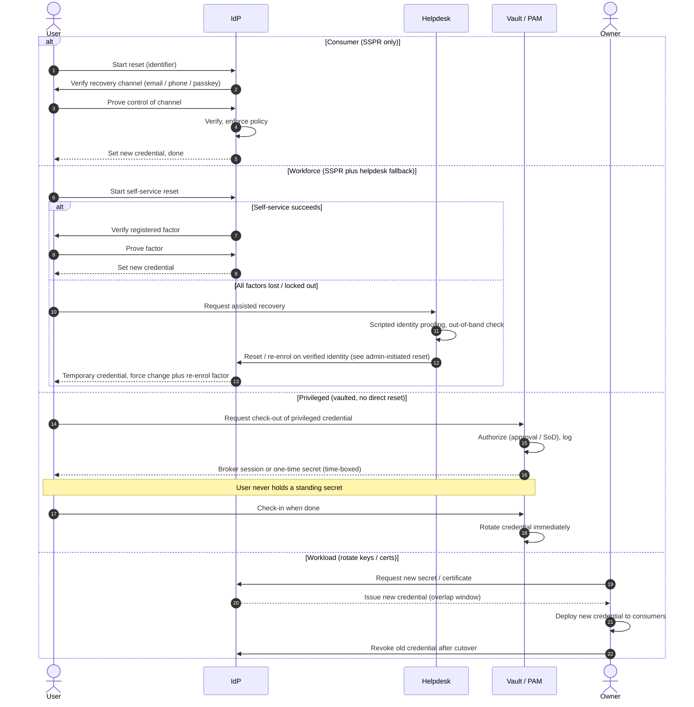

# Credential Recovery by Persona — Sequence Diagram

Each `alt` branch shows what "recovery" means for that persona — reset, assisted reset,
vaulted rotation, or credential re-issue. Base reset mechanics are in the linked diagrams.

Notes

- Consumer has exactly one path; the absence of a helpdesk is the fork.
- Privileged never resets a user-held secret — check-out and post-use rotation replace
  "recovery" entirely, so a lost secret is a non-event.
- Workload "recovery" is overlap-safe rotation: issue new, cut over, then revoke old — reversing
  that order causes an outage rather than a recovery.

Related: [README](README.md) | [Swimlane](swimlane.md) | [Flowchart](flowchart.md)
