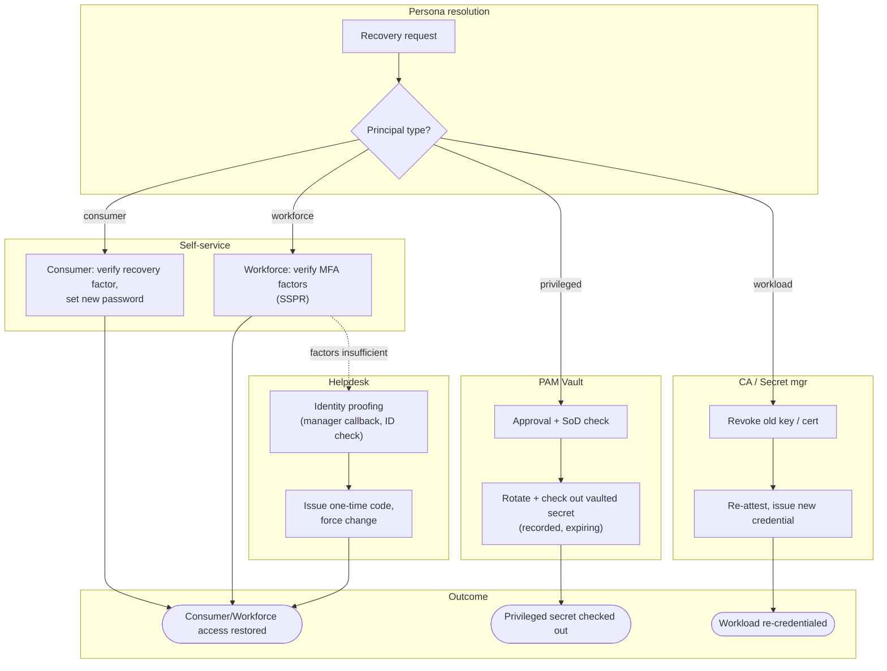

# Credential Recovery by Persona — Swimlane Diagram

A router lane resolves the persona; each persona then flows through its own recovery path.

Notes

- The workforce lane is the only one with a **fallback edge** into the Helpdesk lane, and that
  assisted path is where identity proofing must be strongest.
- The Privileged lane never enters self-service: recovery is a vault operation with approval
  and recording, not a password the holder can set.
- The Machine lane has no human step — revoke-and-reissue replaces the whole notion of a reset.

Related: [README](README.md) | [Sequence](sequence.md) | [Flowchart](flowchart.md)
