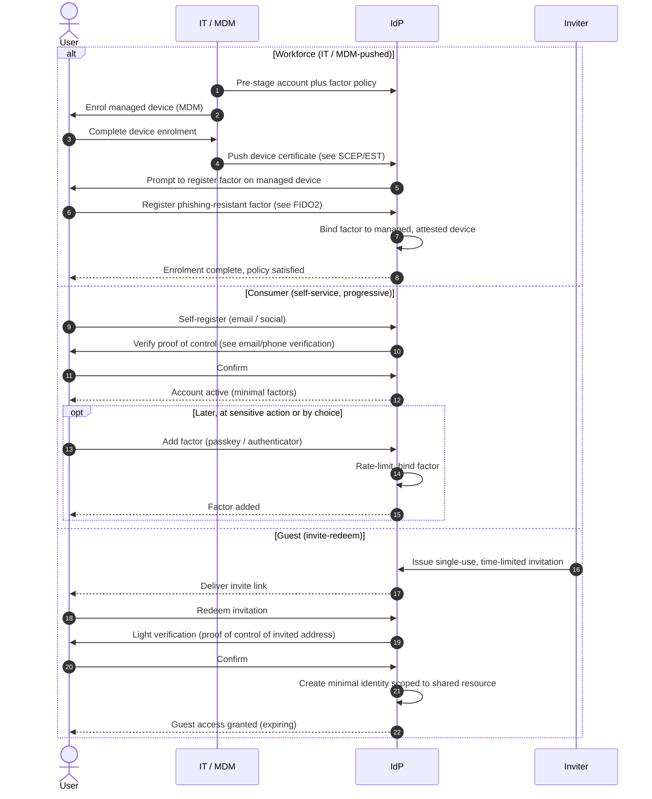

# Enrollment by Persona — Sequence Diagram

Each `alt` branch differs in who starts enrolment and how identity is proven before a factor
is registered. Base factor mechanics live in the linked enrolment diagrams.

Notes

- Workforce enrolment is **pushed** and device-bound; the user never chooses the policy, they
  satisfy it on a managed device.
- Consumer enrolment is **pulled and progressive**: the account exists with minimal factors and
  the user (or a sensitive-action prompt) drives factor addition later.
- Guest enrolment is gated entirely by the **invitation**: no invite, no enrolment, and the
  resulting identity is minimal and time-limited.

Related: [README](README.md) | [Swimlane](swimlane.md) | [Flowchart](flowchart.md)
