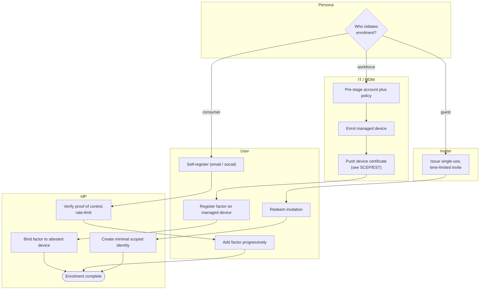

# Enrollment by Persona — Swimlane Diagram

The initiator differs per persona: IT pushes for workforce, the user pulls for consumer, the
inviter gates for guest. The IdP lane is shared.

Notes

- Three different lanes start the flow (IT, User, Inviter), which is exactly the persona fork.
- Only the workforce path traverses the IT lane and produces a device-bound factor.
- The guest path cannot begin without the Inviter lane issuing an invitation first.

Related: [README](README.md) | [Sequence](sequence.md) | [Flowchart](flowchart.md)
