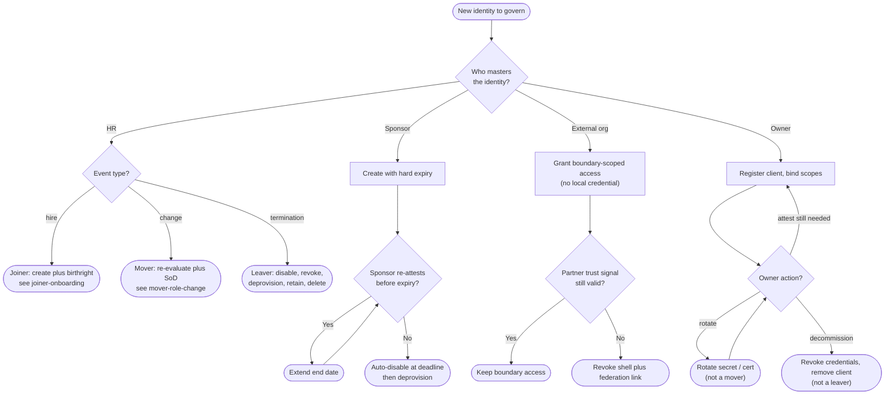

# JML Lifecycle by Persona — Decision Flowchart

Route on **who masters the identity**, then follow each mastering model to its guaranteed end
state. Terminal nodes point to the base transition diagrams.

Notes

- The root diamond is the entire thesis of this diagram: lifecycle forks on **mastering
  authority**, and each authority guarantees an end state differently — HR event, hard
  expiry, lost trust signal, or owner decommission.
- Contractor and Workload both loop (extend / rotate) but each loop is bounded by a control
  (re-attestation, decommission) so no identity becomes permanent by default.
- Partner has no local termination node at all — access simply stops tracking a trust signal
  it no longer receives.

Related: [README](README.md) | [Sequence](sequence.md) | [Swimlane](swimlane.md)
