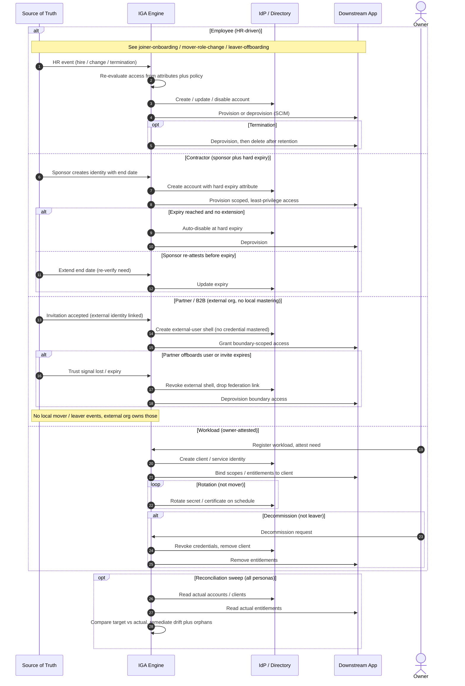

# JML Lifecycle by Persona — Sequence Diagram

The mastering authority differs per persona, so each `alt` branch starts from a different
`Source` and ends in a different terminal semantic (delete, expire, revoke, or decommission).

Notes

- Only the Employee branch has a natural "termination" signal. Contractor relies on a **hard
  expiry**, Partner on an **external trust signal**, Workload on an **owner decision** — three
  different ways of guaranteeing the identity eventually ends.
- Workload has a `loop` (rotation) where humans have a mover, and a `decommission` where
  humans have a leaver — the vocabulary itself forks.
- The reconciliation sweep is shared and is the safety net wherever the per-persona end signal
  is unreliable.

Related: [README](README.md) | [Swimlane](swimlane.md) | [Flowchart](flowchart.md)
