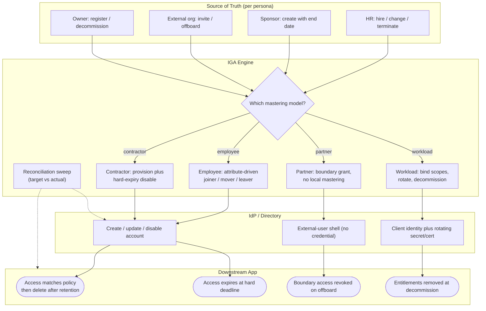

# JML Lifecycle by Persona — Swimlane Diagram

The `Source` lane holds four different mastering authorities. IGA is the shared hub; the end
state in the App lane differs per persona.

Notes

- Four sources, one IGA hub, four distinct terminal semantics — the fork is entirely in the
  source and the end state, not in the orchestration in between.
- The Partner path never mints a local credential (`I2` is a shell), which is why its
  offboarding is a **revoke of a link**, not a directory termination.
- The reconciliation sweep (`G5`) dashes into both the account and app lanes for every persona.

Related: [README](README.md) | [Sequence](sequence.md) | [Flowchart](flowchart.md)
