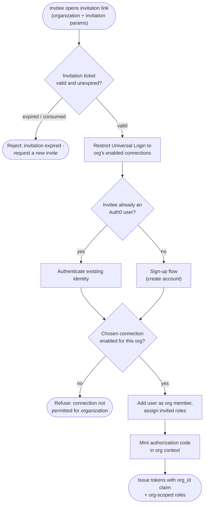

# Auth0 Organizations Invitation — Decision Flowchart

Invitation acceptance and org-context login: ticket validation, existing vs new
user, and the per-organization connection restriction.

```mermaid
flowchart TD
    Start(["Invitee opens invitation link<br/>(organization + invitation params)"]) --> Ticket{"Invitation ticket<br/>valid and unexpired?"}
    Ticket -->|"expired / consumed"| EExp(["Reject: invitation expired -<br/>request a new invite"])
    Ticket -->|valid| Conn["Restrict Universal Login to<br/>org's enabled connections"]

    Conn --> User{"Invitee already an<br/>Auth0 user?"}
    User -->|yes| Existing["Authenticate existing identity"]
    User -->|no| New["Sign-up flow<br/>(create account)"]

    Existing --> Allowed{"Chosen connection<br/>enabled for this org?"}
    New --> Allowed
    Allowed -->|no| EConn(["Refuse: connection not<br/>permitted for organization"])
    Allowed -->|yes| Member["Add user as org member,<br/>assign invited roles"]

    Member --> Code["Mint authorization code<br/>in org context"]
    Code --> Tokens(["Issue tokens with org_id claim<br/>+ org-scoped roles"])
```
