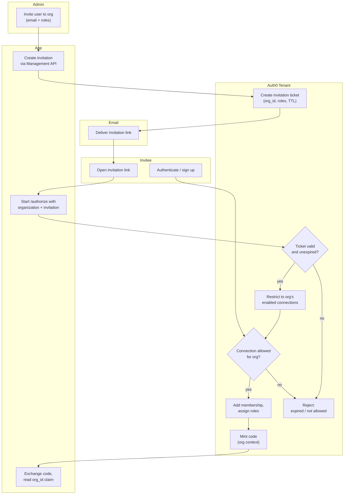

# Auth0 Organizations Invitation — Swimlane

```mermaid
flowchart TD
    subgraph Admin
        AD1["Invite user to org<br/>(email + roles)"]
    end

    subgraph Invitee
        I1["Open invitation link"]
        I2["Authenticate / sign up"]
    end

    subgraph App
        AP1["Create invitation<br/>via Management API"]
        AP2["Start /authorize with<br/>organization + invitation"]
        AP3["Exchange code,<br/>read org_id claim"]
    end

    subgraph Auth0["Auth0 Tenant"]
        A1["Create invitation ticket<br/>(org_id, roles, TTL)"]
        A2{"Ticket valid<br/>and unexpired?"}
        A3["Restrict to org's<br/>enabled connections"]
        A4{"Connection allowed<br/>for org?"}
        A5["Add membership,<br/>assign roles"]
        A6["Mint code<br/>(org context)"]
        A7["Reject:<br/>expired / not allowed"]
    end

    subgraph Email
        E1["Deliver invitation link"]
    end

    AD1 --> AP1 --> A1 --> E1 --> I1
    I1 --> AP2 --> A2
    A2 -->|no| A7
    A2 -->|yes| A3 --> A4
    I2 --> A4
    A4 -->|no| A7
    A4 -->|yes| A5 --> A6 --> AP3
```
