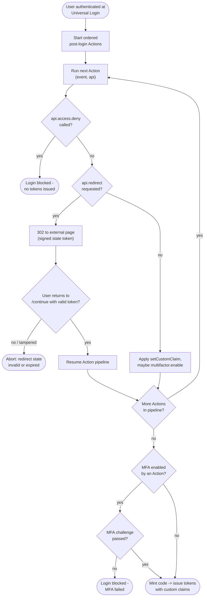

# Auth0 Universal Login + Actions — Decision Flowchart

The post-login Actions pipeline: each Action can enrich, redirect-and-resume,
require MFA, or deny. Terminal states show blocked login and issued tokens.

