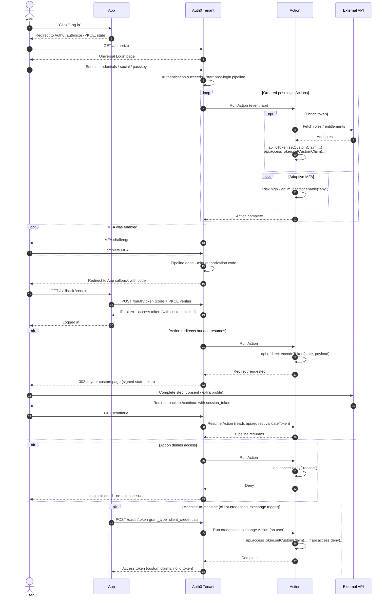

# Auth0 Universal Login + Actions — Sequence Diagram

Happy path: app hits `/authorize`, user authenticates at Universal Login, Auth0 runs
the ordered post-login Actions (enrich claims, optional MFA), then issues tokens via
the standard [OIDC Authorization Code + PKCE](../../oidc/authorization-code-pkce/README.md)
exchange. Alternates: redirect-and-resume, deny, M2M client-credentials-exchange.

