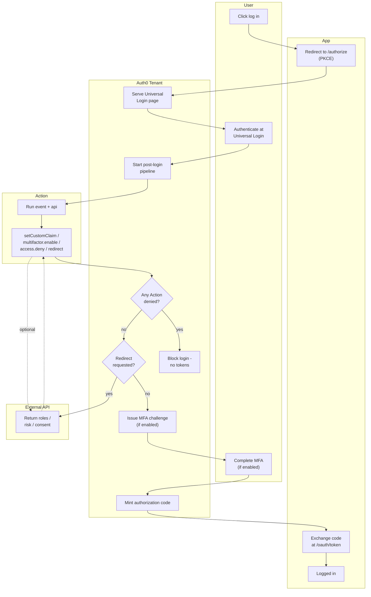

# Auth0 Universal Login + Actions — Swimlane

```mermaid
flowchart TD
    subgraph User
        U1["Click log in"]
        U2["Authenticate at<br/>Universal Login"]
        U3["Complete MFA<br/>(if enabled)"]
    end

    subgraph App
        AP1["Redirect to /authorize<br/>(PKCE)"]
        AP2["Exchange code<br/>at /oauth/token"]
        AP3["Logged in"]
    end

    subgraph Auth0["Auth0 Tenant"]
        A1["Serve Universal<br/>Login page"]
        A2["Start post-login<br/>pipeline"]
        A3{"Any Action<br/>denied?"}
        A4{"Redirect<br/>requested?"}
        A5["Issue MFA challenge<br/>(if enabled)"]
        A6["Mint authorization code"]
        A7["Block login -<br/>no tokens"]
    end

    subgraph Action
        AC1["Run event + api"]
        AC2["setCustomClaim /<br/>multifactor.enable /<br/>access.deny / redirect"]
    end

    subgraph Ext["External API"]
        E1["Return roles /<br/>risk / consent"]
    end

    U1 --> AP1 --> A1 --> U2 --> A2
    A2 --> AC1 --> AC2
    AC2 -.->|optional| E1 -.-> AC2
    AC2 --> A3
    A3 -->|yes| A7
    A3 -->|no| A4
    A4 -->|yes| E1
    A4 -->|no| A5 --> U3 --> A6
    A6 --> AP2 --> AP3
```
