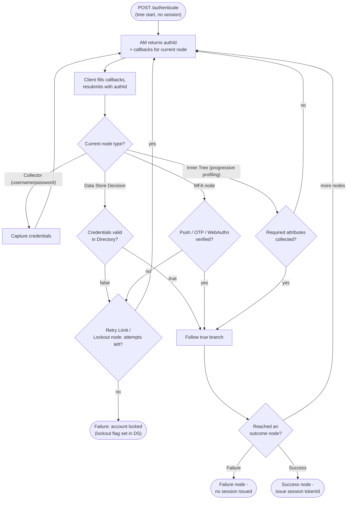

# ForgeRock / PingAM Authentication Journey — Decision Flowchart

Node-by-node tree traversal driven by the `authId` + callbacks loop, with per-node
branch outcomes and the lockout / failure terminals.

