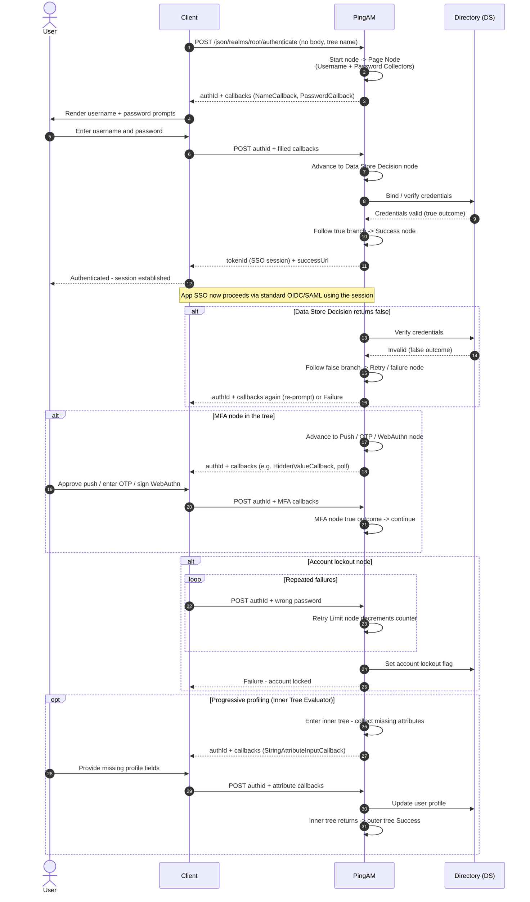

# ForgeRock / PingAM Authentication Journey — Sequence Diagram

Happy path: the client POSTs to `/authenticate`, AM returns `authId` + callbacks per
node (Username Collector, Password Collector, Data Store Decision), the client fills
and resubmits until the tree reaches Success and AM issues a session `tokenId`. From
there app federation is standard
[OIDC](../../oidc/authorization-code-pkce/README.md). Alternates: failure branch, MFA
node, account lockout, progressive profiling inner tree.

