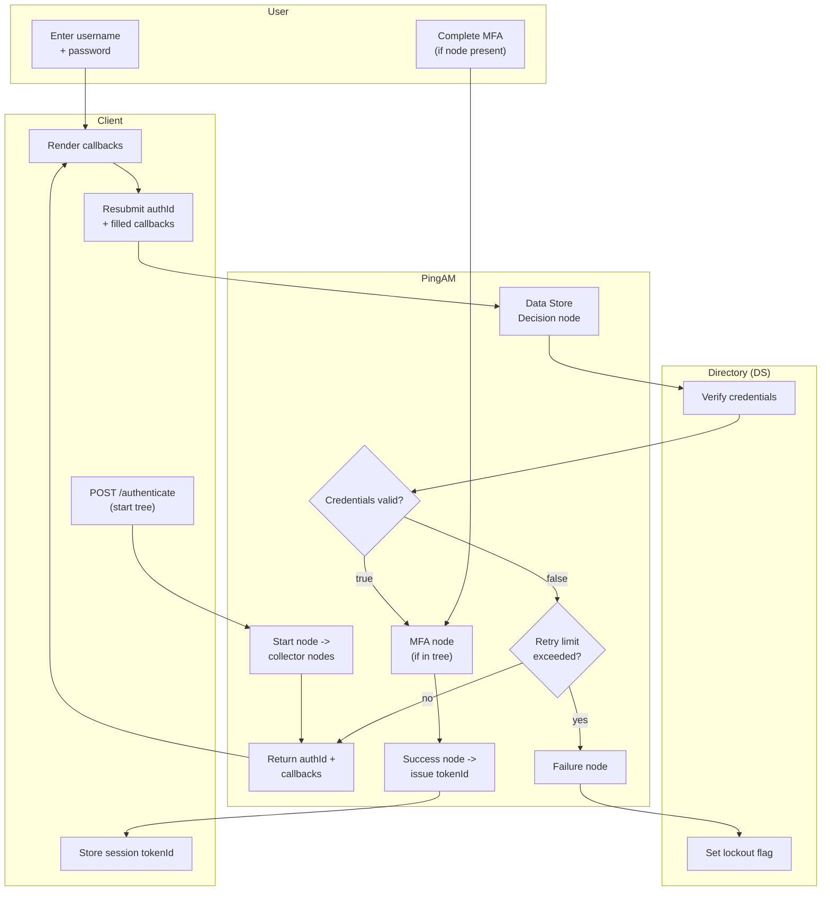

# ForgeRock / PingAM Authentication Journey — Swimlane

```mermaid
flowchart TD
    subgraph User
        U1["Enter username<br/>+ password"]
        U2["Complete MFA<br/>(if node present)"]
    end

    subgraph Client
        C1["POST /authenticate<br/>(start tree)"]
        C2["Render callbacks"]
        C3["Resubmit authId<br/>+ filled callbacks"]
        C4["Store session tokenId"]
    end

    subgraph AM["PingAM"]
        M1["Start node -><br/>collector nodes"]
        M2["Return authId +<br/>callbacks"]
        M3["Data Store<br/>Decision node"]
        M4{"Credentials valid?"}
        M5["MFA node<br/>(if in tree)"]
        M6{"Retry limit<br/>exceeded?"}
        M7["Success node -><br/>issue tokenId"]
        M8["Failure node"]
    end

    subgraph Directory["Directory (DS)"]
        D1["Verify credentials"]
        D2["Set lockout flag"]
    end

    C1 --> M1 --> M2 --> C2
    U1 --> C2 --> C3 --> M3 --> D1 --> M4
    M4 -->|true| M5
    U2 --> M5
    M5 --> M7 --> C4
    M4 -->|false| M6
    M6 -->|no| M2
    M6 -->|yes| M8 --> D2
```
