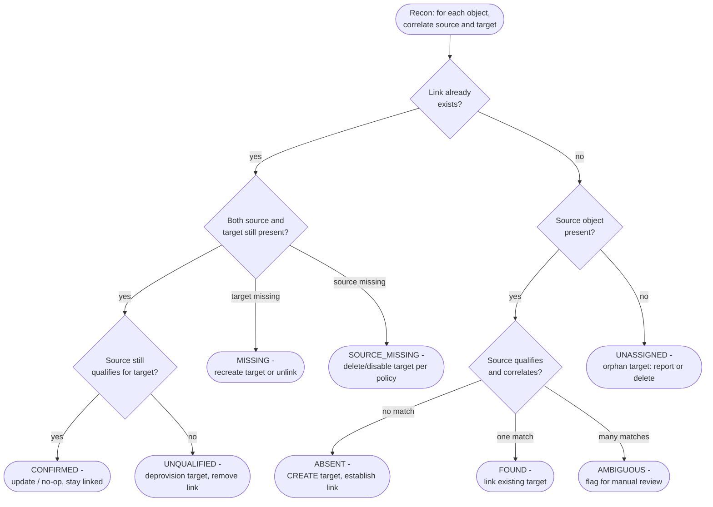

# ForgeRock IDM — Reconciliation Situation Matrix Flowchart

For each correlated object, reconciliation computes a **situation** and runs the
mapping's configured **action**. This chart shows the core situations and their
default remediations, including deprovision on `UNQUALIFIED`.

