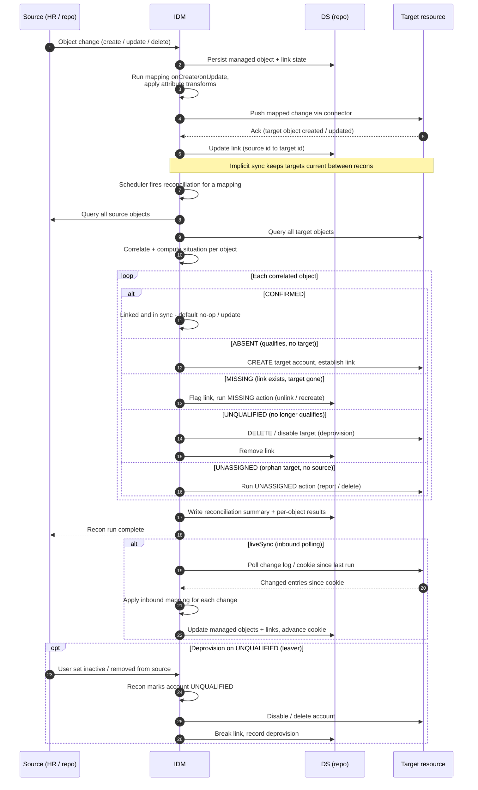

# ForgeRock IDM — Sync & Reconciliation Sequence Diagram

Happy path shows both mechanisms: **implicit sync** pushes a single change out
immediately, while a **scheduled reconciliation** sweeps all objects, computes a
**situation** per object, and runs the mapped action. Alternates: liveSync inbound
polling, deprovision on `UNQUALIFIED`.

