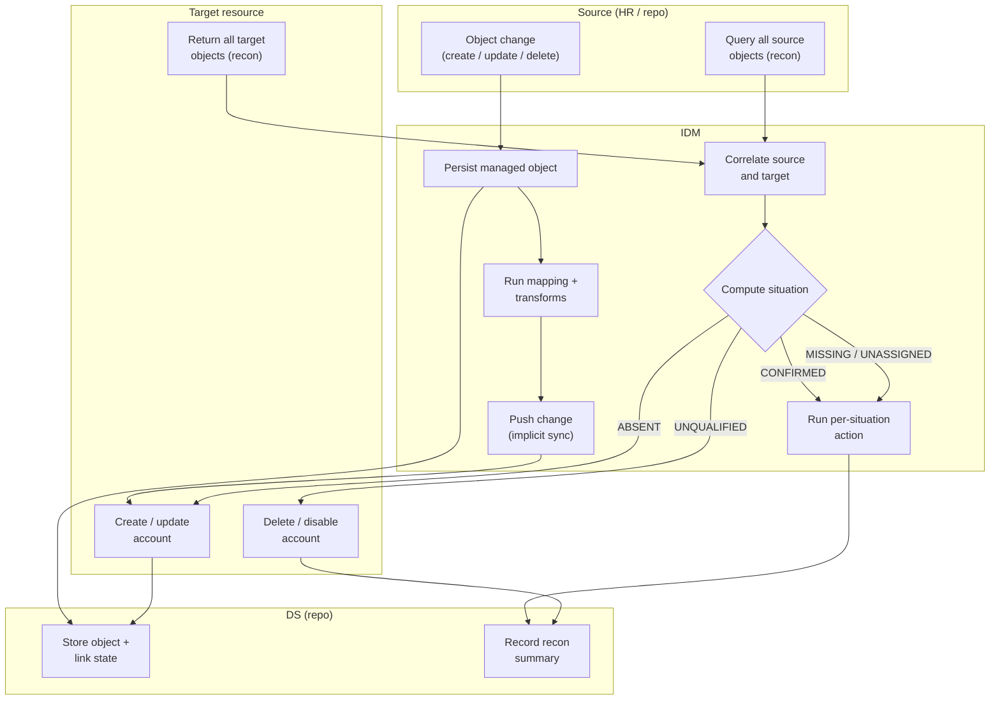

# ForgeRock IDM — Sync & Reconciliation Swimlane

```mermaid
flowchart TD
    subgraph Source["Source (HR / repo)"]
        SR1["Object change<br/>(create / update / delete)"]
        SR2["Query all source<br/>objects (recon)"]
    end

    subgraph IDM
        I1["Persist managed object"]
        I2["Run mapping +<br/>transforms"]
        I3["Correlate source<br/>and target"]
        I4{"Compute situation"}
        I5["Push change<br/>(implicit sync)"]
        I6["Run per-situation<br/>action"]
    end

    subgraph DS["DS (repo)"]
        D1["Store object +<br/>link state"]
        D2["Record recon<br/>summary"]
    end

    subgraph Target["Target resource"]
        T1["Create / update<br/>account"]
        T2["Delete / disable<br/>account"]
        T3["Return all target<br/>objects (recon)"]
    end

    SR1 --> I1 --> D1
    I1 --> I2 --> I5 --> T1
    T1 --> D1

    SR2 --> I3
    T3 --> I3
    I3 --> I4
    I4 -->|"CONFIRMED"| I6
    I4 -->|"ABSENT"| T1
    I4 -->|"UNQUALIFIED"| T2
    I4 -->|"MISSING / UNASSIGNED"| I6
    I6 --> D2
    T2 --> D2
```
