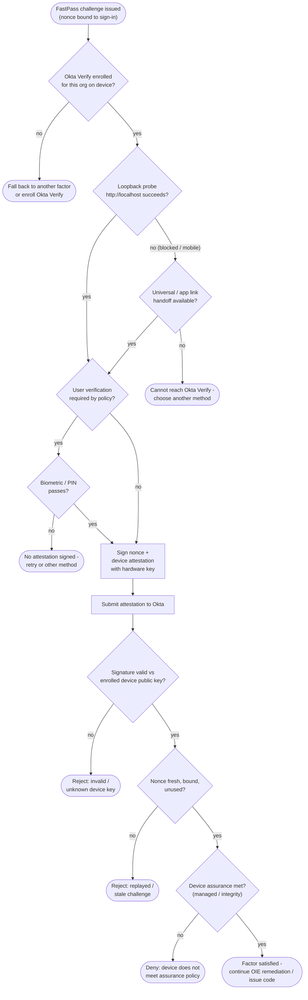

# Okta FastPass — Decision Flowchart

Transport selection (loopback vs universal link) followed by the server-side
attestation and device-assurance validation pipeline.

```mermaid
flowchart TD
    Start(["FastPass challenge issued<br/>(nonce bound to sign-in)"]) --> Reg{"Okta Verify enrolled<br/>for this org on device?"}
    Reg -->|no| EReg(["Fall back to another factor<br/>or enroll Okta Verify"])
    Reg -->|yes| Loop{"Loopback probe<br/>http://localhost succeeds?"}

    Loop -->|yes| UV
    Loop -->|"no (blocked / mobile)"| ULink{"Universal / app link<br/>handoff available?"}
    ULink -->|no| ETrans(["Cannot reach Okta Verify -<br/>choose another method"])
    ULink -->|yes| UV{"User verification<br/>required by policy?"}

    UV -->|yes| DoUV{"Biometric / PIN<br/>passes?"}
    DoUV -->|no| EUV(["No attestation signed -<br/>retry or other method"])
    DoUV -->|yes| Sign
    UV -->|no| Sign["Sign nonce +<br/>device attestation<br/>with hardware key"]

    Sign --> Submit["Submit attestation to Okta"]
    Submit --> Sig{"Signature valid vs<br/>enrolled device public key?"}
    Sig -->|no| ESig(["Reject: invalid /<br/>unknown device key"])
    Sig -->|yes| Nonce{"Nonce fresh, bound,<br/>unused?"}
    Nonce -->|no| ENonce(["Reject: replayed /<br/>stale challenge"])
    Nonce -->|yes| Assure{"Device assurance met?<br/>(managed / integrity)"}
    Assure -->|no| EAssure(["Deny: device does not<br/>meet assurance policy"])
    Assure -->|yes| OK(["Factor satisfied -<br/>continue OIE remediation / issue code"])
```
