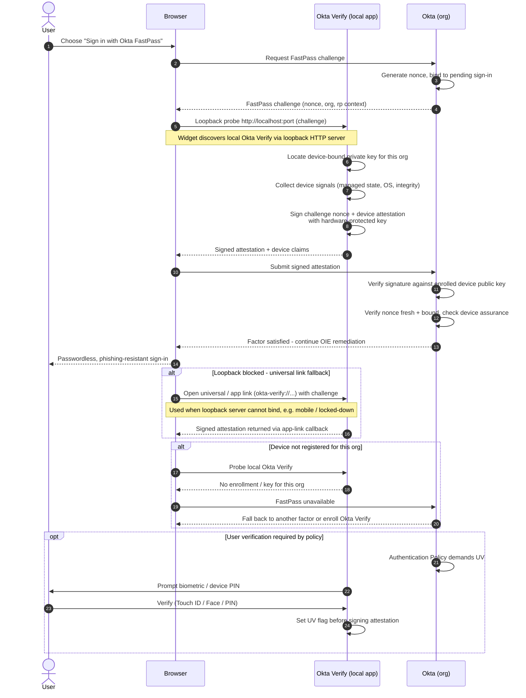

# Okta FastPass — Sequence Diagram

Happy path: Okta challenges FastPass, the Sign-In Widget probes the local Okta Verify
app over loopback, Okta Verify returns a device-bound signed attestation, Okta
verifies it and device assurance. This runs as one factor inside the OIE
[policy pipeline](../okta-identity-engine-signin/README.md). Alternates: universal-link
fallback, device not registered, user-verification required.

