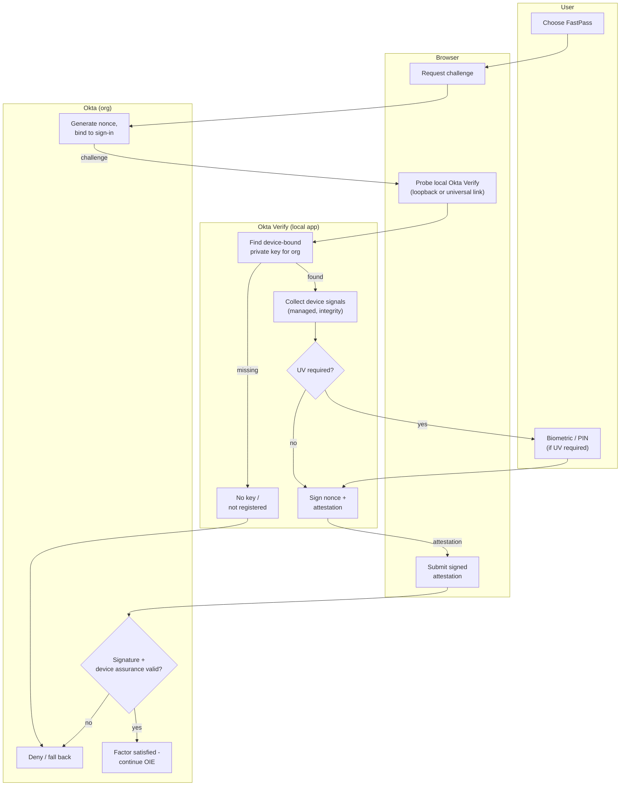

# Okta FastPass — Swimlane

```mermaid
flowchart TD
    subgraph User
        U1["Choose FastPass"]
        U2["Biometric / PIN<br/>(if UV required)"]
    end

    subgraph Browser
        B1["Request challenge"]
        B2["Probe local Okta Verify<br/>(loopback or universal link)"]
        B3["Submit signed<br/>attestation"]
    end

    subgraph OV["Okta Verify (local app)"]
        V1["Find device-bound<br/>private key for org"]
        V2["Collect device signals<br/>(managed, integrity)"]
        V3{"UV required?"}
        V4["Sign nonce +<br/>attestation"]
        V5["No key /<br/>not registered"]
    end

    subgraph Okta["Okta (org)"]
        O1["Generate nonce,<br/>bind to sign-in"]
        O2{"Signature +<br/>device assurance valid?"}
        O3["Factor satisfied -<br/>continue OIE"]
        O4["Deny / fall back"]
    end

    U1 --> B1 --> O1
    O1 -->|challenge| B2 --> V1
    V1 -->|found| V2 --> V3
    V1 -->|missing| V5 --> O4
    V3 -->|yes| U2 --> V4
    V3 -->|no| V4
    V4 -->|attestation| B3 --> O2
    O2 -->|yes| O3
    O2 -->|no| O4
```
