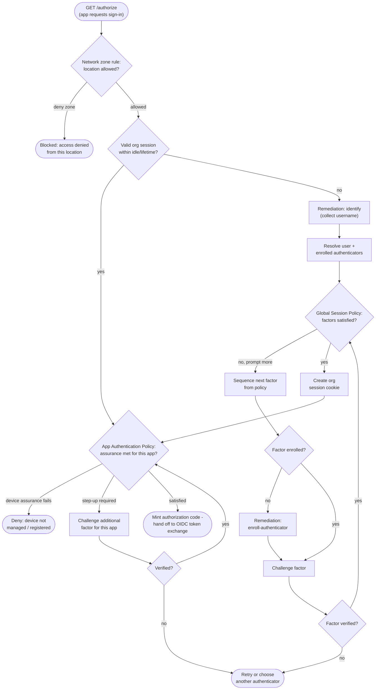

# Okta Identity Engine Sign-In — Decision Flowchart

Two-layer policy evaluation: **Global Session Policy** gates the org session,
then the app **Authentication Policy** gates release of the specific app. The
`/idx` remediation loop sequences and enrolls factors dynamically.

