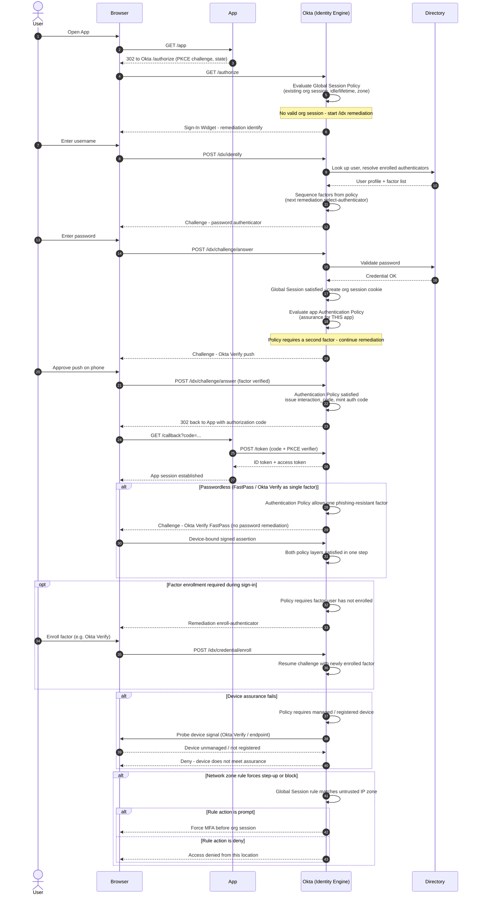

# Okta Identity Engine Sign-In — Sequence Diagram

Happy path: app redirects to Okta `/authorize`, the Identity Engine runs the `/idx`
remediation loop under **Global Session Policy** then the app **Authentication
Policy**, dynamically sequences factors, and returns an authorization code. Token
exchange itself is standard
[OIDC Authorization Code + PKCE](../../oidc/authorization-code-pkce/README.md).
Alternates: passwordless, inline factor enrollment, device assurance, network zone.

