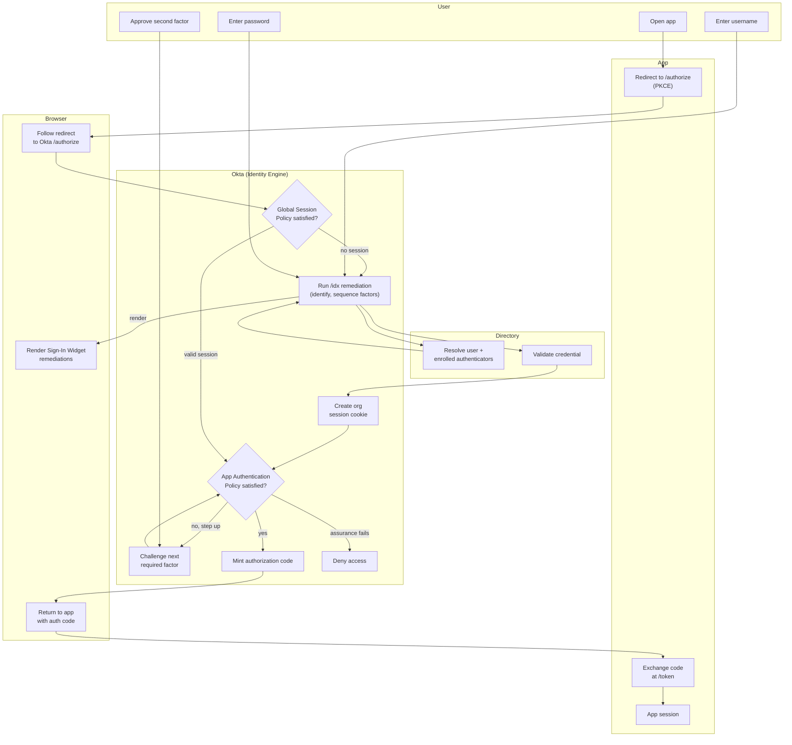

# Okta Identity Engine Sign-In — Swimlane

```mermaid
flowchart TD
    subgraph User
        U1["Open app"]
        U2["Enter username"]
        U3["Enter password"]
        U4["Approve second factor"]
    end

    subgraph Browser
        B1["Follow redirect<br/>to Okta /authorize"]
        B2["Render Sign-In Widget<br/>remediations"]
        B3["Return to app<br/>with auth code"]
    end

    subgraph App
        AP1["Redirect to /authorize<br/>(PKCE)"]
        AP2["Exchange code<br/>at /token"]
        AP3["App session"]
    end

    subgraph Okta["Okta (Identity Engine)"]
        O1{"Global Session<br/>Policy satisfied?"}
        O2["Run /idx remediation<br/>(identify, sequence factors)"]
        O3["Create org<br/>session cookie"]
        O4{"App Authentication<br/>Policy satisfied?"}
        O5["Challenge next<br/>required factor"]
        O6["Mint authorization code"]
        O7["Deny access"]
    end

    subgraph Directory
        D1["Resolve user +<br/>enrolled authenticators"]
        D2["Validate credential"]
    end

    U1 --> AP1 --> B1 --> O1
    O1 -->|no session| O2
    U2 --> O2
    O2 --> D1 --> O2
    U3 --> O2
    O2 --> D2 --> O3
    O3 --> O4
    O1 -->|valid session| O4
    O4 -->|no, step up| O5
    U4 --> O5
    O5 --> O4
    O4 -->|yes| O6 --> B3 --> AP2
    O4 -->|assurance fails| O7
    AP2 --> AP3
    O2 -->|render| B2
```
