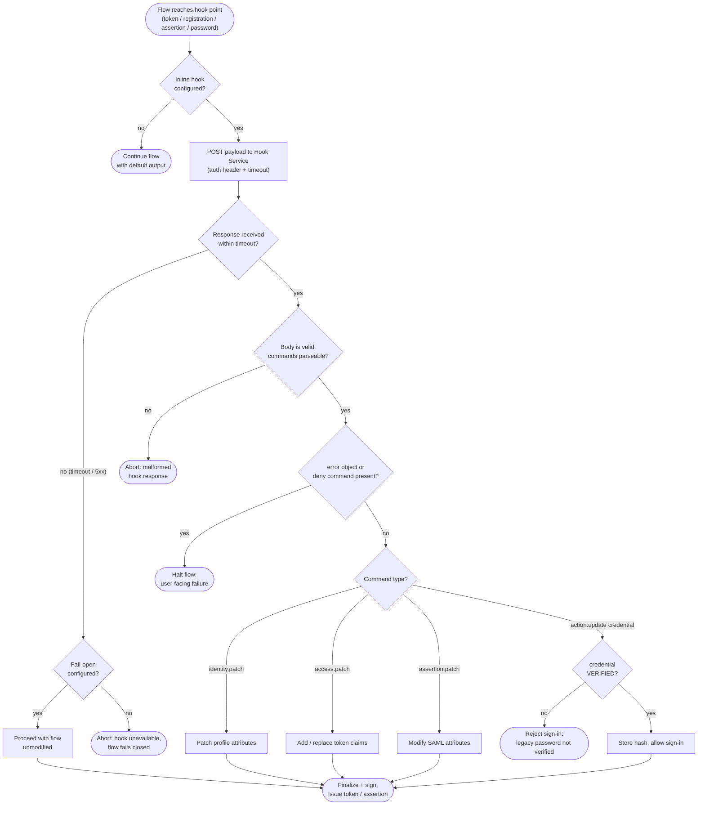

# Okta Inline Hooks — Decision Flowchart

How Okta handles the synchronous hook response: command application, deny/error
handling, and the fail-open vs fail-close timeout policy.

```mermaid
flowchart TD
    Start(["Flow reaches hook point<br/>(token / registration / assertion / password)"]) --> Enabled{"Inline hook<br/>configured?"}
    Enabled -->|no| Plain(["Continue flow<br/>with default output"])
    Enabled -->|yes| Call["POST payload to Hook Service<br/>(auth header + timeout)"]

    Call --> Resp{"Response received<br/>within timeout?"}
    Resp -->|"no (timeout / 5xx)"| Fail{"Fail-open<br/>configured?"}
    Fail -->|yes| Plain2["Proceed with flow<br/>unmodified"]
    Plain2 --> Done
    Fail -->|no| ETimeout(["Abort: hook unavailable,<br/>flow fails closed"])

    Resp -->|yes| Valid{"Body is valid,<br/>commands parseable?"}
    Valid -->|no| EBad(["Abort: malformed<br/>hook response"])
    Valid -->|yes| Err{"error object or<br/>deny command present?"}
    Err -->|yes| EDeny(["Halt flow:<br/>user-facing failure"])
    Err -->|no| Type{"Command type?"}

    Type -->|"identity.patch"| Apply["Patch profile attributes"]
    Type -->|"access.patch"| Apply2["Add / replace token claims"]
    Type -->|"assertion.patch"| Apply3["Modify SAML attributes"]
    Type -->|"action.update credential"| Cred{"credential<br/>VERIFIED?"}
    Cred -->|no| ECred(["Reject sign-in:<br/>legacy password not verified"])
    Cred -->|yes| Apply4["Store hash, allow sign-in"]

    Apply --> Done
    Apply2 --> Done
    Apply3 --> Done
    Apply4 --> Done(["Finalize + sign,<br/>issue token / assertion"])
```
