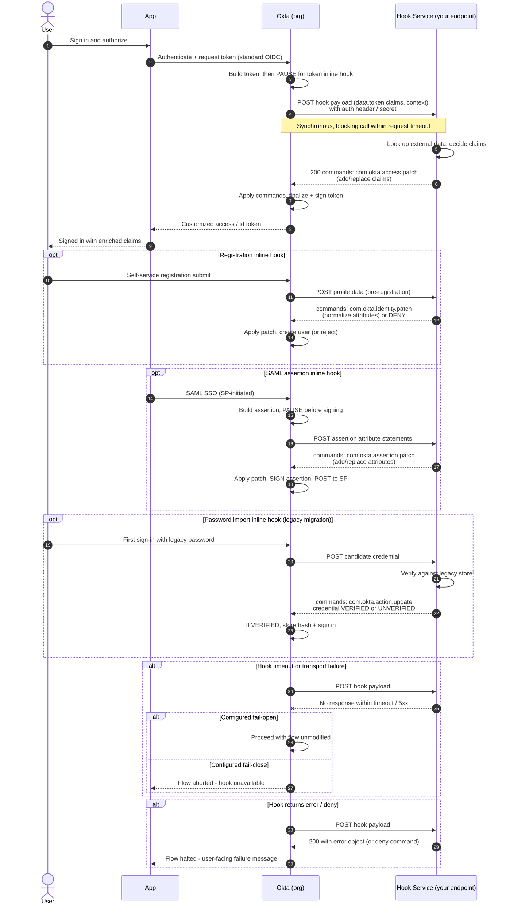

# Okta Inline Hooks — Sequence Diagram

Happy path (token inline hook): a token is about to be issued via the standard
[OIDC Authorization Code flow](../../oidc/authorization-code/README.md); Okta pauses,
calls the external Hook Service synchronously, applies the returned `commands`, then
issues the customized token. The registration, SAML assertion, and password import
hooks follow the same pause-callout-commands pattern. Alternates: timeout fallback,
error/deny.

