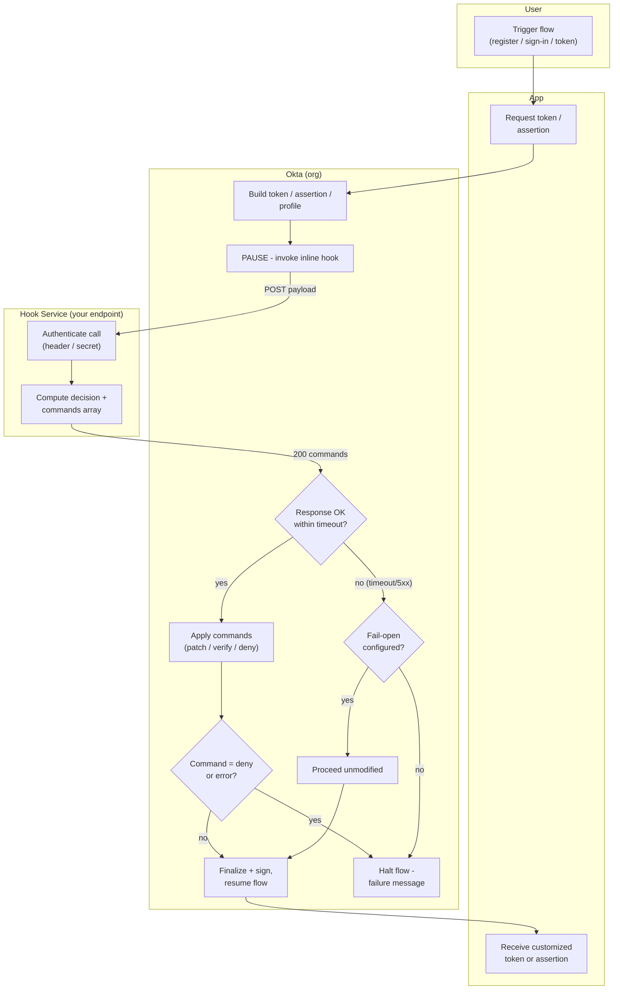

# Okta Inline Hooks — Swimlane

```mermaid
flowchart TD
    subgraph User
        U1["Trigger flow<br/>(register / sign-in / token)"]
    end

    subgraph App
        AP1["Request token /<br/>assertion"]
        AP2["Receive customized<br/>token or assertion"]
    end

    subgraph Okta["Okta (org)"]
        O1["Build token / assertion /<br/>profile"]
        O2["PAUSE - invoke inline hook"]
        O3{"Response OK<br/>within timeout?"}
        O4["Apply commands<br/>(patch / verify / deny)"]
        O5{"Command = deny<br/>or error?"}
        O6["Finalize + sign,<br/>resume flow"]
        O7["Halt flow -<br/>failure message"]
        O8{"Fail-open<br/>configured?"}
        O9["Proceed unmodified"]
    end

    subgraph Hook["Hook Service (your endpoint)"]
        H1["Authenticate call<br/>(header / secret)"]
        H2["Compute decision +<br/>commands array"]
    end

    U1 --> AP1 --> O1 --> O2
    O2 -->|"POST payload"| H1 --> H2
    H2 -->|"200 commands"| O3
    O3 -->|yes| O4 --> O5
    O5 -->|no| O6 --> AP2
    O5 -->|yes| O7
    O3 -->|"no (timeout/5xx)"| O8
    O8 -->|yes| O9 --> O6
    O8 -->|no| O7
```
