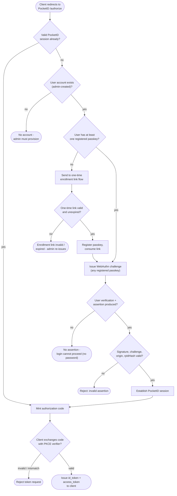

# PocketID — Passkey-Only OIDC Decision Flowchart

Decision logic combining the passkey-only login gate with OIDC authorization-code
issuance. Because PocketID is passwordless, a missing or invalid passkey has no
password fallback.

