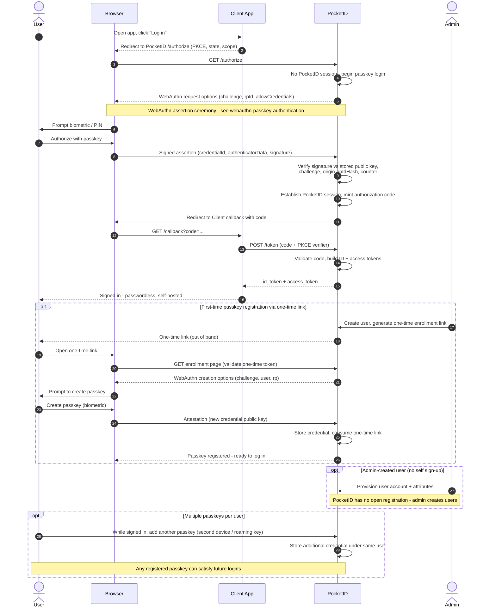

# PocketID — Passkey Login + OIDC Issuance Sequence Diagram

Happy path: a client redirects to PocketID's `/authorize`; PocketID authenticates the
user with a passkey (the WebAuthn ceremony detailed in
[WebAuthn / Passkey Authentication](../../tokenless/webauthn-passkey-authentication/README.md)),
then issues an authorization code exchanged for tokens per
[OIDC Authorization Code + PKCE](../../oidc/authorization-code-pkce/README.md).
Alternates: first-time one-time-link registration, admin-created user, multiple
passkeys.

