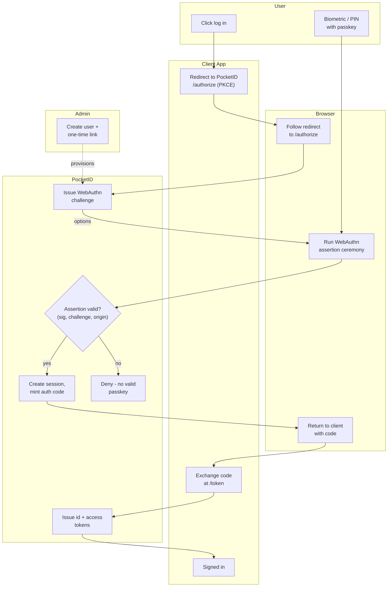

# PocketID — Passkey Login + OIDC Issuance Swimlane

```mermaid
flowchart TD
    subgraph User
        U1["Click log in"]
        U2["Biometric / PIN<br/>with passkey"]
    end

    subgraph Browser
        B1["Follow redirect<br/>to /authorize"]
        B2["Run WebAuthn<br/>assertion ceremony"]
        B3["Return to client<br/>with code"]
    end

    subgraph Client["Client App"]
        C1["Redirect to PocketID<br/>/authorize (PKCE)"]
        C2["Exchange code<br/>at /token"]
        C3["Signed in"]
    end

    subgraph PID["PocketID"]
        P1["Issue WebAuthn<br/>challenge"]
        P2{"Assertion valid?<br/>(sig, challenge, origin)"}
        P3["Create session,<br/>mint auth code"]
        P4["Issue id + access<br/>tokens"]
        P5["Deny - no valid<br/>passkey"]
    end

    subgraph Admin
        AD1["Create user +<br/>one-time link"]
    end

    AD1 -.->|provisions| P1
    U1 --> C1 --> B1 --> P1
    P1 -->|options| B2 --> P2
    U2 --> B2
    P2 -->|yes| P3 --> B3 --> C2 --> P4 --> C3
    P2 -->|no| P5
```
