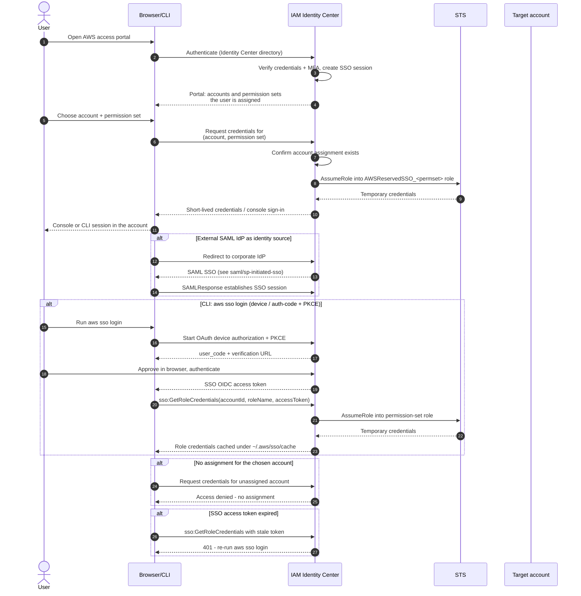

# IAM Identity Center SSO — Sequence Diagram

Happy path first: portal sign-in, pick an account + permission set, get temporary
credentials. Then alternates: external SAML IdP as source, CLI `aws sso login` device
flow, and no assignment for the chosen account.

Notes

- Identity Center never hands out long-lived keys; every path ends in an STS
  `AssumeRole` into the permission-set role.
- Permission sets are provisioned as IAM roles named
  `AWSReservedSSO_<PermissionSetName>_<hash>` in each assigned account.
- The CLI flow reuses OAuth device authorization / authorization code with PKCE — see
  [OIDC Authorization Code + PKCE](../../../../authentication/oidc/authorization-code-pkce/README.md).
