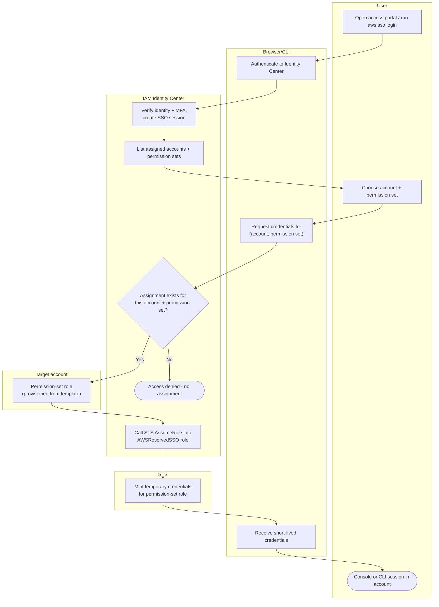

# IAM Identity Center SSO — Swimlane Diagram

One lane per actor. Identity Center authenticates and orchestrates the STS assume into the
permission-set role in the target account.

Notes

- The permission-set role in each `Acct` lane is materialized from a single central
  template; account assignment (`N3`) is the authorization gate.
- The external-IdP and CLI device-flow variants change only how the SSO session at `N1` is
  established — see [sequence.md](./sequence.md).
- Every session is short-lived and per (account, permission set); no standing credentials
  live in the account.
