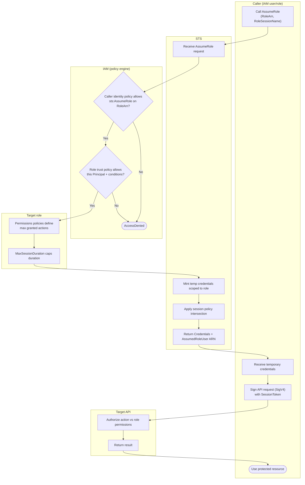

# STS AssumeRole — Swimlane Diagram

One lane per actor. The two policy evaluations live in the IAM lane; the credential mint
lives in the STS lane.

Notes

- Both `M1` and `M2` must pass; the trust policy (`M2`) is the account-B-side gate in
  cross-account scenarios.
- `R2` (`MaxSessionDuration`) bounds the requested `DurationSeconds`; exceeding it is a
  validation error before any credential is minted.
- The session-policy step (`T3`) can only shrink permissions — see
  [flowchart.md](./flowchart.md).
