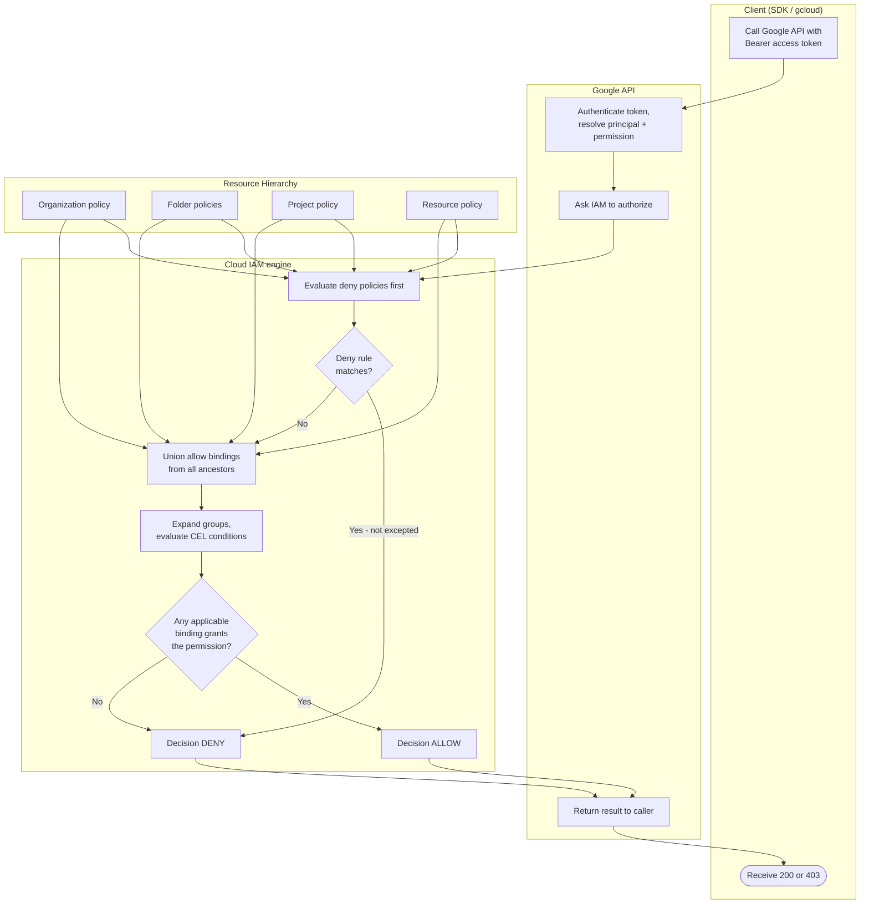

# IAM Allow-Policy Evaluation — Swimlane Diagram

One lane per actor. The Hierarchy lane shows the ancestry levels whose policies are unioned.

Notes

- Both deny and allow evaluation read the full ancestry (org → folder → project → resource);
  the Hierarchy lane feeds `M1` and `M3`.
- Inheritance is additive: a grant at any level flows down, so `M3` unions rather than picks a
  single policy.
- Condition and deny failures both land on the same DENY terminal `M7`; the
  [flowchart.md](./flowchart.md) separates the reasons.
